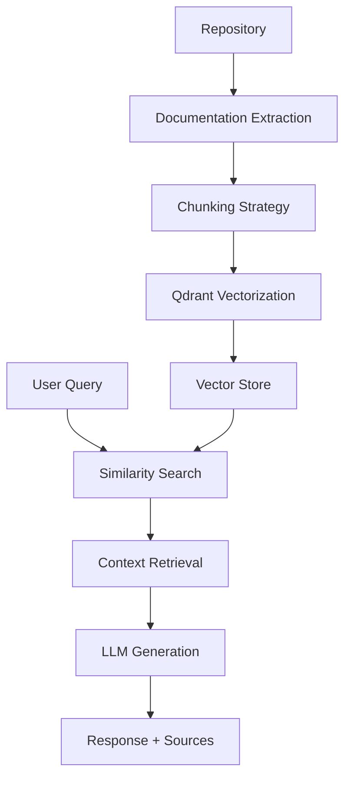
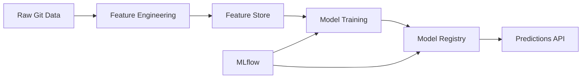
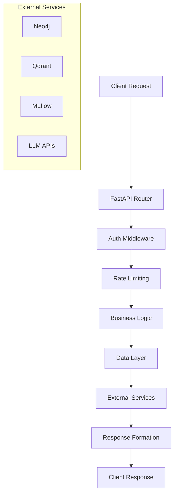

# 📊 Flux de Données - Hyperion v2.7

Documentation détaillée des flux de données dans l'architecture Hyperion v2.7

---

## 🌊 **Vue d'ensemble des Flux de Données**

Hyperion v2.7 traite les données selon plusieurs pipelines interconnectés :

### 📋 **Types de Flux**
1. **🔄 Pipeline Git** : Analyse repositories → Extraction données
2. **🧠 Pipeline RAG** : Indexation → Vectorisation → Recherche
3. **🤖 Pipeline ML** : Features → Training → Prédictions
4. **📊 Pipeline API** : Requêtes → Processing → Réponses

---

## 🔄 **Pipeline Git - Analyse Repositories**

### 📥 **Input Sources**
```yaml
Sources de données:
  - Git repositories (local/remote)
  - Commit history
  - File content & metadata
  - Branch information
  - Author statistics
```

### ⚙️ **Processing Stages**

#### 1️⃣ **Git Extraction**
```python
# Extraction données Git
Repository Analysis:
  ├── Commits extraction
  ├── Files analysis (AST parsing)
  ├── Author metrics
  ├── Branch topology
  └── Change patterns
```

#### 2️⃣ **Code Analysis**
```python
# Analyse statique du code
Code Intelligence:
  ├── AST parsing (tree-sitter)
  ├── Complexity metrics
  ├── Dependencies mapping
  ├── Quality assessment
  └── Pattern detection
```

#### 3️⃣ **Metrics Generation**
```python
# Génération métriques
Metrics Pipeline:
  ├── Code quality scores
  ├── Team collaboration metrics
  ├── Technical debt assessment
  ├── Business impact scores
  └── Temporal patterns
```

### 📤 **Outputs**
- **Neo4j Graph** : Relations code/teams/commits
- **Feature Store** : 35+ engineered features
- **JSON Profiles** : Repository summaries

---

## 🧠 **Pipeline RAG - Retrieval Augmented Generation**

### 📊 **Data Flow RAG**



### 🔧 **Processing Details**

#### 1️⃣ **Documentation Extraction**
```python
Document Types:
  ├── README.md files
  ├── Code comments
  ├── Docstrings
  ├── Configuration files
  └── API documentation
```

#### 2️⃣ **Chunking Strategy**
```python
Chunking Parameters:
  ├── Max chunk size: 512 tokens
  ├── Overlap: 50 tokens
  ├── Semantic boundaries
  ├── Code block preservation
  └── Context continuity
```

#### 3️⃣ **Vectorization**
```python
Embedding Process:
  ├── Model: all-MiniLM-L6-v2
  ├── Dimension: 384
  ├── Normalization: L2
  ├── Storage: Qdrant
  └── Indexing: HNSW
```

### 📈 **Performance Metrics**
- **Indexation** : ~1000 chunks/sec
- **Recherche** : <100ms similarity search
- **Génération** : <3s end-to-end (mode ultra-rapide)

---

## 🤖 **Pipeline ML - Machine Learning**

### 🏗️ **Architecture ML Pipeline**



### 📊 **Feature Engineering Pipeline**

#### 1️⃣ **Data Sources**
```python
Input Data:
  ├── Git commits & changes
  ├── Code quality metrics
  ├── Team collaboration patterns
  ├── Historical patterns
  └── Business context
```

#### 2️⃣ **Feature Categories** (35+ features)
```python
Feature Groups:
  ├── Code Quality (12 features)
  │   ├── Complexity scores
  │   ├── Test coverage
  │   └── Code smells
  ├── Team Dynamics (8 features)
  │   ├── Commit frequency
  │   ├── Review patterns
  │   └── Collaboration metrics
  ├── Business Impact (10 features)
  │   ├── Priority scores
  │   ├── Risk assessments
  │   └── Impact projections
  └── Temporal Patterns (5+ features)
      ├── Trend analysis
      ├── Seasonality
      └── Change velocity
```

#### 3️⃣ **Feature Store Operations**
```python
Feature Store:
  ├── Storage: Parquet + Redis cache
  ├── Versioning: Feature lineage tracking
  ├── Validation: Schema + drift detection
  ├── Serving: Real-time + batch
  └── Monitoring: Quality metrics
```

### 🎯 **Model Training Pipeline**

#### 1️⃣ **Training Data Preparation**
```python
Data Pipeline:
  ├── Feature aggregation (sliding windows)
  ├── Target variable engineering
  ├── Train/validation/test splits (70/15/15)
  ├── Cross-validation setup (5-fold)
  └── Data quality checks
```

#### 2️⃣ **Model Training**
```python
Models Pipeline:
  ├── RiskPredictor: RandomForest + XGBoost
  ├── AnomalyDetector: IsolationForest
  ├── BugPredictor: Temporal patterns
  ├── ImpactAnalyzer: Change propagation
  └── Meta-learner: Ensemble voting
```

#### 3️⃣ **MLflow Integration**
```python
ML Tracking:
  ├── Experiment tracking
  ├── Model versioning
  ├── Performance metrics
  ├── Artifact storage
  └── Model registry
```

### 📊 **Prediction Pipeline**
```python
Real-time Predictions:
  ├── Feature computation (cached)
  ├── Model loading (registry)
  ├── Inference execution
  ├── Result formatting
  └── Monitoring/logging
```

---

## 📊 **Pipeline API - Request Processing**

### 🌐 **API Data Flow**



### 🔧 **Processing Layers**

#### 1️⃣ **API Gateway Layer**
```python
Request Processing:
  ├── Authentication (JWT)
  ├── Rate limiting (per endpoint)
  ├── Input validation
  ├── Request routing
  └── Error handling
```

#### 2️⃣ **Business Logic Layer**
```python
Core Operations:
  ├── Repository analysis
  ├── RAG query processing
  ├── ML predictions
  ├── Data aggregation
  └── Response formatting
```

#### 3️⃣ **Data Layer**
```python
Data Access:
  ├── Neo4j queries (graph data)
  ├── Qdrant searches (vectors)
  ├── MLflow model serving
  ├── File system operations
  └── Cache management
```

### 📈 **Performance Optimization**

#### 🚀 **Caching Strategy**
```python
Cache Layers:
  ├── Redis: Feature cache (TTL: 1h)
  ├── Memory: Model cache (LRU: 100MB)
  ├── Disk: Profile cache (persistent)
  └── CDN: Static documentation
```

#### ⚡ **Parallel Processing**
```python
Concurrency:
  ├── AsyncIO for I/O operations
  ├── ThreadPool for CPU tasks
  ├── Queue system for batch jobs
  └── Connection pooling
```

---

## 🔄 **Flux Intégrés**

### 🔀 **Cross-Pipeline Communication**

```python
Integration Points:
  ├── Git → ML: Features generation
  ├── ML → RAG: Enhanced context
  ├── RAG → API: Query responses
  ├── API → Git: Trigger analysis
  └── Monitoring: Cross-pipeline metrics
```

### 📊 **Data Consistency**

#### 1️⃣ **State Management**
```python
Consistency Strategy:
  ├── Event sourcing for Git changes
  ├── ACID transactions (where possible)
  ├── Eventual consistency (distributed)
  ├── Conflict resolution strategies
  └── Data validation pipelines
```

#### 2️⃣ **Monitoring & Health**
```python
Health Checks:
  ├── Pipeline status monitoring
  ├── Data quality checks
  ├── Performance metrics
  ├── Error rate tracking
  └── Alert systems
```

---

## 📈 **Monitoring et Métriques**

### 🎯 **KPIs par Pipeline**

#### 📊 **Pipeline Git**
- **Throughput** : Repositories/hour analyzed
- **Latency** : Analysis time per repository
- **Quality** : Feature extraction success rate

#### 🧠 **Pipeline RAG**
- **Indexation** : Documents/second processed
- **Retrieval** : Query response time (<100ms)
- **Relevance** : Answer quality scores

#### 🤖 **Pipeline ML**
- **Training** : Model performance metrics
- **Inference** : Prediction latency (<50ms)
- **Accuracy** : Model drift detection

#### 📊 **Pipeline API**
- **Availability** : 99.9% uptime target
- **Latency** : P95 response time <200ms
- **Throughput** : Requests/second capacity

---

## 🛠️ **Outils de Debug**

### 🔍 **Observability Stack**
```python
Monitoring Tools:
  ├── Logs: Structured JSON logging
  ├── Metrics: Prometheus + Grafana
  ├── Traces: OpenTelemetry
  ├── Health: Custom dashboard
  └── Alerts: Alertmanager
```

### 🐛 **Debugging Utilities**
```bash
# Pipeline status
hyperion info --pipeline-status

# Data flow debugging
hyperion debug --trace-request <request_id>

# Performance profiling
hyperion profile --enable-profiling
```

---

## 🔗 **Références**

- **[System Overview](system-overview.md)** : Architecture générale
- **[ML Platform](../ml-platform/README.md)** : Infrastructure ML
- **[API Reference](../reference/api-reference.md)** : Documentation API
- **[Configuration](../user-guide/configuration.md)** : Configuration des pipelines

---

*Documentation flux de données mise à jour pour Hyperion v2.7.0 - Décembre 2024*