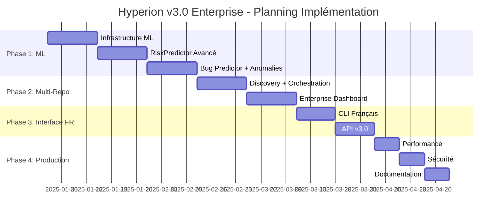

# Hyperion v3.0 Enterprise Ready - Plan d'Implémentation

## Vue d'ensemble

**Objectif**: Transformer Hyperion en solution enterprise-ready avec intelligence multi-repository, ML avancé et analyse de risque prédictive.

**Version cible**: v3.0.0
**Préparation**: v2.5 (branche `v2.5-enterprise-prep`)
**Focus prioritaire**: ML/AI avancé + Analyse de risque + Intelligence multi-repositories
**Langue**: Interface et prompts en français pour usage professionnel

---

## 1. Architecture Multi-Repository Intelligence

### 1.1 Nouveaux Modules

```
src/hyperion/modules/
├── multi_repo/
│   ├── __init__.py
│   ├── orchestrateur.py        # Orchestrateur central multi-repos
│   ├── decouverte_repos.py     # Découverte automatique repositories
│   ├── analyseur_croise.py     # Analyse cross-repository
│   ├── cartographe_deps.py     # Mapping dépendances inter-repos
│   └── gestionnaire_sync.py    # Synchronisation données
├── enterprise/
│   ├── __init__.py
│   ├── tableau_bord.py         # Dashboard global organisation
│   ├── rapporteur.py          # Génération rapports enterprise
│   ├── agregateur_metriques.py # Agrégation métriques multi-repos
│   └── gouvernance.py         # Gouvernance & politiques
├── ml/                         # Nouveaux modèles ML
│   ├── __init__.py
│   ├── risk_predictor_advanced.py    # RiskPredictor ML avancé
│   ├── bug_predictor.py              # Prédiction bugs
│   ├── anomaly_detector_ml.py        # Détection anomalies ML
│   ├── code_smell_detector.py        # Détection code smells ML
│   ├── refactoring_suggester.py      # Suggestions refactoring
│   ├── training_pipeline.py          # Pipeline entraînement
│   └── model_validator.py            # Validation modèles
```

### 1.2 Fonctionnalités Multi-Repo

- **Découverte Automatique**: Auto-détection repos dans organisation
- **Analyse Cross-Project**: Dépendances entre projets détectées
- **Graphe Neo4j Unifié**: Relations inter-repos centralisées
- **Synchronisation Incrementale**: Mise à jour optimisée multi-repos

---

## 2. ML/AI Avancé - Focus Principal

### 2.1 RiskPredictor v3.0 - Modèles ML Réels

```python
class PredicteurRisqueAvance:
    """Prédicteur de risque basé sur ensemble de modèles ML."""

    def __init__(self):
        self.modele_ensemble = ModeleEnsembleRisque()
        self.extracteur_features = ExtracteurFeaturesAvance()
        self.apprentissage_historique = ApprentissageHistorique()
        self.seuils_confiance = SeuilsConfianceML()
        self.explicateur = ExplicateurSHAP()

    def predire_risque(self, contexte: ContexteRisque) -> PredictionRisque:
        """Prédit le risque avec modèles ML et explication."""

        # Extraction features complètes
        features = self.extracteur_features.extraire_comprehensive(contexte)

        # Prédiction ensemble avec confiance
        prediction = self.modele_ensemble.predire(features)
        confiance = self.modele_ensemble.calculer_confiance(features)

        # Explication SHAP
        facteurs_explicatifs = self.explicateur.expliquer(features, prediction)

        return PredictionRisque(
            niveau=prediction.niveau,
            probabilite=prediction.probabilite,
            confiance=confiance,
            facteurs_explicatifs=facteurs_explicatifs,
            recommandations_fr=self.generer_recommandations_fr(contexte)
        )
```

### 2.2 Features ML Avancées (35+ features)

```python
FEATURES_ML_AVANCEES = [
    # Métriques code (12 features)
    "complexite_cyclomatique", "complexite_cognitive", "complexite_npath",
    "lignes_de_code", "densite_commentaires", "delta_couverture_tests",
    "nb_methodes", "nb_classes", "profondeur_heritage", "couplage_entrant",
    "cohesion_classe", "indice_maintenabilite",

    # Historique Git (8 features)
    "frequence_commits", "experience_auteur", "age_fichier_jours",
    "nb_bugs_historiques", "frequence_rollbacks", "nb_hotfixes",
    "nb_contributeurs_uniques", "volatilite_fichier",

    # Dépendances (6 features)
    "profondeur_dependances", "nb_dependances_circulaires", "nb_deps_externes",
    "risque_breaking_changes", "nb_conflits_versions", "fan_in_fan_out",

    # Dynamiques équipe (5 features)
    "experience_moyenne_reviewers", "vitesse_approbation_moyenne",
    "nb_discussions_moyennes", "distribution_connaissance", "facteur_bus",

    # Impact métier (4 features)
    "estimation_trafic_affecte", "score_impact_revenus",
    "niveau_criticite_module", "difficulte_rollback"
]
```

### 2.3 Prédicteur de Bugs ML

```python
class PredicteurBugs:
    """Prédit la probabilité d'apparition de bugs via ML."""

    def __init__(self):
        self.modele_xgboost = XGBClassifier(
            n_estimators=200, max_depth=8, learning_rate=0.1
        )
        self.modele_isolation_forest = IsolationForest(contamination=0.1)
        self.extracteur_historique = ExtracteurFeaturesHistoriques()

    def predire_probabilite_bug(self, chemin_fichier: str) -> PredictionBug:
        """Prédit probabilité bug dans 30 jours avec explication française."""

        features = self.extracteur_historique.extraire(chemin_fichier)

        # Prédiction principale
        proba_bug = self.modele_xgboost.predict_proba(features)[0][1]

        # Détection anomalie
        score_anomalie = self.modele_isolation_forest.decision_function(features)[0]

        # Génération rapport français
        rapport_fr = self.generer_rapport_fr(features, proba_bug, score_anomalie)

        return PredictionBug(
            probabilite=proba_bug,
            score_anomalie=score_anomalie,
            horizon="30 jours",
            facteurs_principaux=features.get_top_factors(),
            rapport_detaille_fr=rapport_fr,
            actions_preventives=self.suggerer_actions_preventives_fr(features)
        )

    def generer_rapport_fr(self, features, proba, anomalie) -> str:
        """Génère un rapport détaillé en français."""
        rapport = f"""
📊 ANALYSE PRÉDICTIVE DE BUGS
═══════════════════════════

🎯 Probabilité de bug : {proba:.1%}
🔍 Score d'anomalie : {anomalie:.2f}

📈 FACTEURS DE RISQUE PRINCIPAUX :
{self.formater_facteurs_risque_fr(features)}

💡 RECOMMANDATIONS :
{self.generer_recommandations_fr(features, proba)}
"""
        return rapport
```

### 2.4 Détecteur Code Smells ML

```python
class DetecteurCodeSmellsML:
    """Détection code smells avec modèles ML et interface française."""

    CODE_SMELLS_FR = {
        "methode_longue": "Méthode trop longue",
        "classe_massive": "Classe trop volumineuse",
        "envie_fonctionnalite": "Envie de fonctionnalité",
        "classe_donnees": "Classe de données simple",
        "objet_dieu": "Objet dieu (responsabilités multiples)",
        "chirurgie_fusil": "Chirurgie au fusil de chasse",
        "code_mort": "Code mort non utilisé",
        "code_duplique": "Code dupliqué",
        "intimite_inappropriee": "Intimité inappropriée entre classes",
        "chaines_messages": "Chaînes de messages trop longues"
    }

    def detecter_smells_avec_explications_fr(self, fichier: str) -> List[CodeSmellDetecte]:
        """Détecte code smells avec explications en français."""

        smells_detectes = []
        metriques = self.extraire_metriques(fichier)

        for smell_type, modele in self.modeles_smells.items():
            probabilite = modele.predict_proba(metriques)[0][1]

            if probabilite > SEUILS_DETECTION[smell_type]:
                # Explication SHAP en français
                explication_fr = self.explicateur_shap.expliquer_fr(
                    modele, metriques, smell_type
                )

                smell = CodeSmellDetecte(
                    type_fr=self.CODE_SMELLS_FR[smell_type],
                    probabilite=probabilite,
                    severite=self.calculer_severite(probabilite),
                    localisation_precise=self.localiser_dans_fichier(fichier, smell_type),
                    explication_detaillee_fr=explication_fr,
                    suggestions_refactoring_fr=self.generer_suggestions_fr(smell_type)
                )

                smells_detectes.append(smell)

        return smells_detectes
```

---

## 3. CLI Extensions v3.0 (Interface Française)

### 3.1 Nouvelles Commandes CLI

```bash
# Multi-Repository Enterprise
hyperion enterprise init CHEMIN_ORG --nom "Mon Organisation"
hyperion enterprise decouvrir --auto --filtres "*.git" --exclure node_modules
hyperion enterprise analyser --cross-repo --rapport-detaille
hyperion enterprise tableau-bord --servir --port 8080 --langue fr

# Commandes ML Avancées (interface française)
hyperion ml entrainer --modele predicteur-risque --donnees historiques/
hyperion ml predire --fichier src/utils.py --type risque --details
hyperion ml valider --modele tous --metriques precision,rappel,f1
hyperion ml expliquer --prediction derniere --format markdown
hyperion ml benchmark --comparer-modeles --graphiques --export pdf

# Analyse Risque Avancée
hyperion risque analyser-profond FICHIER --contexte-historique
hyperion risque lot-analyse REPO --seuil medium --rapport-executif
hyperion risque tendances --periode 6mois --graphiques
hyperion risque simulation-impact --changements BRANCH --prediction

# Qualité Code ML
hyperion qualite scanner-intelligent REPO --ml-actif --auto-fix
hyperion qualite detecter-smells --ia-avancee --suggestions-detaillees
hyperion qualite refactoring-suggere --implementation-auto false
hyperion qualite metriques-avancees --export dashboard --temps-reel

# Monitoring & Alertes
hyperion monitor modeles --derive-donnees --alertes-slack
hyperion monitor performance --metrics-ml --seuils-personnalises
hyperion monitor repos --multi-organisation --dashboard-central

# Utilitaires Enterprise
hyperion rapport generer --organisation ACME --type mensuel --format pdf
hyperion gouvernance verificar --politiques actives --auto-remediation
hyperion audit tracer --periode 30j --compliance --export legal
```

### 3.2 Configuration CLI Enterprise Française

```yaml
# .hyperion/config-enterprise.yaml
enterprise:
  organisation_id: "acme-corporation"
  nom_organisation: "ACME Corporation SAS"
  racine_repositories: "/srv/repos/acme/"
  decouverte_auto: true
  intervalle_sync: "2h"
  fuseau_horaire: "Europe/Paris"

interface:
  langue: "fr"
  format_dates: "DD/MM/YYYY HH:mm"
  format_nombres: "fr_FR"
  devise: "EUR"
  rapports_langue: "francais"

modeles_ml:
  predicteur_risque_avance:
    chemin_modele: "modeles/risque_v3_ensemble.pkl"
    seuil_confiance_minimum: 0.75
    reentrainement_auto: "hebdomadaire"
    features_actives: "toutes"
    explicabilite_shap: true

  predicteur_bugs:
    chemin_modele: "modeles/bugs_xgboost_v3.pkl"
    horizon_prediction: "30j"
    seuil_alerte_critique: 0.8
    tendances_temporelles: true

  detecteur_code_smells:
    modeles_actifs: ["methode_longue", "objet_dieu", "code_duplique"]
    seuils_personnalises:
      methode_longue: 0.7
      objet_dieu: 0.8
      code_duplique: 0.6
    suggestions_auto_refactoring: false

gouvernance:
  politiques_enterprise:
    securite_obligatoire: true
    couverture_tests_min: 80
    complexite_max: 15
    revue_code_obligatoire: true

  alertes_automatiques:
    canaux: ["slack", "email", "teams"]
    severites: ["medium", "high", "critical"]
    escalade_auto: true

  rapports_conformite:
    frequence: "hebdomadaire"
    destinataires: ["cto@acme.com", "devops@acme.com"]
    format_preference: "pdf_detaille"

ml_pipeline:
  entrainement_auto:
    active: true
    frequence: "mensuel"
    validation_croisee: true
    A_B_testing: true

  monitoring_modeles:
    derive_donnees: true
    performance_degradation: true
    alertes_critiques: true

  infrastructure:
    gpu_required: false  # true pour modèles deep learning
    distributed_training: false
    model_registry: "mlflow"
```

---

## 4. Orchestration hyperion_master v3.0

### 4.1 Extensions hyperion_master.sh

**Le script existant sera étendu pour supporter v3.0 tout en maintenant la compatibilité.**

```bash
# Nouvelles options v3.0
parse_args() {
  while [[ $# -gt 0 ]]; do
    case $1 in
      # Options existantes...
      --auto|--repo|--modules|--skip-verification|--no-dashboard|--no-openwebui)
        # Code existant...
        ;;

      # ✨ NOUVELLES OPTIONS v3.0
      --enterprise)
        ENTERPRISE_MODE=true
        shift
        ;;
      --organisation)
        ORGANISATION_ID="$2"
        shift 2
        ;;
      --ml-avance)
        ML_ADVANCED=true
        shift
        ;;
      --entrainement-ml)
        ML_TRAINING=true
        shift
        ;;
      --francais)
        LANGUE_FR=true
        shift
        ;;
      --multi-repo)
        MULTI_REPO_MODE=true
        shift
        ;;
      *)
        echo "Option inconnue: $1"
        show_help_v3
        exit 1
        ;;
    esac
  done
}

# Nouveau help v3.0
show_help_v3() {
  cat << EOF
🚀 HYPERION MASTER v3.0 ENTERPRISE - Orchestrateur Intelligent

USAGE:
  $0 [OPTIONS]

OPTIONS v2.x (COMPATIBILITÉ):
  --auto                     Mode automatique
  --repo PATH               Repository à analyser
  --modules v1,v2,rag       Modules classiques

OPTIONS v3.0 (NOUVELLES):
  --enterprise              Active mode entreprise multi-repos
  --organisation ORG_ID     ID organisation (défaut: auto-detect)
  --ml-avance              Lance modèles ML avancés (RiskPredictor, BugPredictor)
  --entrainement-ml         Mode entraînement/validation modèles
  --francais               Interface et prompts en français
  --multi-repo             Analyse cross-repository

MODULES v3.0:
  v1         Ingestion Git stats (compatible v2.x)
  v2         Code analysis Neo4j (compatible v2.x)
  rag        RAG embeddings (compatible v2.x)
  ml         Modèles ML avancés (NOUVEAU)
  enterprise Dashboard multi-repos (NOUVEAU)
  formation  Entraînement modèles ML (NOUVEAU)

EXEMPLES v3.0:
  $0 --enterprise --francais                    # Mode entreprise français
  $0 --ml-avance --entrainement-ml              # ML avec entraînement
  $0 --multi-repo --organisation acme           # Multi-repos ACME
  $0 --auto --modules v1,v2,rag,ml,enterprise   # Stack complet v3.0

EOF
}

# Nouveaux modules v3.0
run_ml_advanced() {
  section "🤖 MODÈLES ML AVANCÉS v3.0"

  # Vérification environnement virtuel OBLIGATOIRE
  if [ ! -d "venv" ]; then
    fail "Environnement virtuel requis pour ML avancé"
    echo "Exécutez: python3 -m venv venv && source venv/bin/activate"
    exit 1
  fi

  source venv/bin/activate || {
    fail "Impossible d'activer l'environnement virtuel"
    exit 1
  }

  ok "Environnement virtuel activé"

  # Vérification dépendances ML
  echo "🔍 Vérification dépendances ML..."
  python3 -c "
import sys
try:
    import sklearn, xgboost, lightgbm, shap
    print('✅ Dépendances ML présentes')
except ImportError as e:
    print(f'❌ Dépendances manquantes: {e}')
    print('💡 Installez: pip install scikit-learn xgboost lightgbm shap')
    sys.exit(1)
"

  # Entraînement si demandé
  if [ "$ML_TRAINING" = true ]; then
    echo "🔄 Entraînement modèles ML avancés..."
    python3 -c "
from hyperion.modules.ml.training_pipeline import PipelineEntrainementML

print('🚀 Démarrage pipeline entraînement ML...')
pipeline = PipelineEntrainementML()

# Entraînement ensemble de modèles
resultats = pipeline.entrainer_tous_modeles(validation_croisee=True)
print(f'✅ Entraînement terminé: {resultats}')

# Validation et benchmarks
scores = pipeline.valider_modeles()
print(f'📊 Scores validation: {scores}')
"
    ok "Modèles ML entraînés et validés"
  fi

  # Test modèles
  echo "🧪 Test modèles ML opérationnels..."
  python3 -c "
from hyperion.modules.ml.risk_predictor_advanced import PredicteurRisqueAvance
from hyperion.modules.ml.bug_predictor import PredicteurBugs

try:
    # Test RiskPredictor
    risk_predictor = PredicteurRisqueAvance()
    print('✅ RiskPredictor avancé chargé')

    # Test BugPredictor
    bug_predictor = PredicteurBugs()
    print('✅ BugPredictor chargé')

    print('🎯 Modèles ML v3.0 opérationnels')
except Exception as e:
    print(f'⚠️ Erreur modèles ML: {e}')
"
}

run_enterprise_mode() {
  section "🏢 MODE ENTREPRISE MULTI-REPOS"

  local org_id="${ORGANISATION_ID:-$(basename "$PWD")-org}"
  info "Organisation: $org_id"

  # Découverte repos dans organisation
  echo "🔍 Découverte repositories organisation..."
  python3 -c "
from hyperion.modules.multi_repo.decouverte_repos import DecouverteRepos
from hyperion.modules.enterprise.orchestrateur import OrchestrateursEnterprise

print('🔄 Scan organisation $org_id...')
decouverte = DecouverteRepos()
repos_trouves = decouverte.scanner_organisation('$REPO_PATH')

print(f'📊 {len(repos_trouves)} repositories découverts')
for repo in repos_trouves[:5]:  # Afficher 5 premiers
    print(f'  • {repo}')

if len(repos_trouves) > 5:
    print(f'  ... et {len(repos_trouves)-5} autres')

# Analyse cross-repository
orchestrateur = OrchestrateursEnterprise('$org_id')
resultats_analyse = orchestrateur.analyser_cross_dependencies(repos_trouves)
print(f'✅ Analyse cross-repo terminée: {resultats_analyse}')
"

  ok "Mode entreprise configuré"
}

# Vérifications étendues v3.0
verify_services_v3() {
  verify_services  # Appel fonction existante

  # Vérifications supplémentaires v3.0
  section "🔍 VÉRIFICATIONS v3.0"

  # Modèles ML
  echo "🤖 Modèles ML..."
  if [ -d "modeles/" ]; then
    model_count=$(find modeles/ -name "*.pkl" -o -name "*.joblib" | wc -l)
    if [ "$model_count" -gt 0 ]; then
      ok "Modèles ML: $model_count modèles disponibles"
    else
      warn "Aucun modèle ML pré-entraîné (utilisez --entrainement-ml)"
    fi
  else
    warn "Dossier modeles/ absent (sera créé au premier entraînement)"
  fi

  # GPU pour ML (optionnel)
  if command -v nvidia-smi &>/dev/null && nvidia-smi &>/dev/null; then
    gpu_info=$(nvidia-smi --query-gpu=name --format=csv,noheader | head -1)
    ok "GPU détecté: $gpu_info (accélération ML)"
  else
    info "Mode CPU pour ML (normal pour la plupart des cas)"
  fi

  # Espace disque modèles
  if [ -d "modeles/" ]; then
    disk_usage=$(du -sh modeles/ 2>/dev/null | cut -f1)
    info "Espace modèles ML: $disk_usage"
  fi
}

# Mise à jour module validation v3.0
test_hyperion_v3() {
  section "🚀 VALIDATION HYPERION v3.0 COMPLÈTE"

  # Tests v2.x existants
  test_hyperion_v2

  # Nouveaux tests v3.0
  local repo_name=$(basename "$REPO_PATH")

  # Test 5: ML Risk Prediction
  echo "   5. ML Risk Prediction avancée..."
  if curl -s -X POST http://localhost:8000/api/v3/ml/risk/predict \
    -H "Content-Type: application/json" \
    -d "{\"repo\":\"$repo_name\",\"fichier\":\"test.py\",\"contexte_historique\":true}" | python3 -c "
import sys, json
try:
  data = json.load(sys.stdin)
  niveau_risque = data.get('niveau_risque', 'unknown')
  confiance = data.get('confiance', 0)
  print(f'✅ ML Risk Prediction: {niveau_risque} (confiance: {confiance:.2f})')
except:
  print('⚠️ ML Risk Prediction indisponible')
  exit(1)
"; then
    echo "   ✓ ML Risk Prediction opérationnel"
  else
    warn "ML Risk Prediction échec (modèles non entraînés ?)"
  fi

  # Test 6: Bug Prediction
  echo "   6. Bug Prediction ML..."
  if curl -s -X POST http://localhost:8000/api/v3/ml/bugs/predict \
    -H "Content-Type: application/json"  \
    -d "{\"repo\":\"$repo_name\",\"fichier\":\"test.py\"}" | python3 -c "
import sys, json
try:
  data = json.load(sys.stdin)
  probabilite = data.get('probabilite_bug', 0)
  print(f'✅ Bug Prediction: {probabilite:.1%} probabilité')
except:
  print('⚠️ Bug Prediction indisponible')
  exit(1)
"; then
    echo "   ✓ Bug Prediction opérationnel"
  else
    warn "Bug Prediction échec"
  fi

  # Test 7: Enterprise Multi-Repo
  if [ "$ENTERPRISE_MODE" = true ]; then
    echo "   7. Enterprise Multi-Repo..."
    if curl -s "http://localhost:8000/api/v3/enterprise/organisations/$ORGANISATION_ID/overview" | python3 -c "
import sys, json
try:
  data = json.load(sys.stdin)
  nb_repos = data.get('total_repositories', 0)
  print(f'✅ Enterprise: {nb_repos} repositories')
except:
  print('⚠️ Enterprise mode indisponible')
  exit(1)
"; then
      echo "   ✓ Enterprise Multi-Repo opérationnel"
    else
      warn "Enterprise Multi-Repo échec"
    fi
  fi

  ok "🎯 Validation Hyperion v3.0 Enterprise réussie!"
}

# Résumé étendu v3.0
show_summary_v3() {
  section "🎉 RÉSUMÉ HYPERION v3.0 ENTERPRISE"

  local repo_name=$(basename "$REPO_PATH")

  echo "📱 ${BOLD}Services actifs:${NC}"
  echo "   • API Hyperion v3.0  : http://localhost:8000 (ML + Enterprise)"
  if [ "$LAUNCH_DASHBOARD" = true ]; then
    echo "   • Dashboard React    : http://localhost:3000 (multi-repos)"
  fi
  if [ "$LAUNCH_OPENWEBUI" = true ]; then
    echo "   • Open WebUI Chat    : http://localhost:3001 (IA français)"
  fi
  if [ "$ENTERPRISE_MODE" = true ]; then
    echo "   • Dashboard Enterprise: http://localhost:8080"
  fi
  echo "   • Neo4j Browser      : http://localhost:7474"
  echo "   • Qdrant Vector DB   : http://localhost:6333"

  echo ""
  echo "🤖 ${BOLD}Modèles ML v3.0:${NC}"
  python3 -c "
import os
if os.path.exists('modeles/'):
    models = [f for f in os.listdir('modeles/') if f.endswith(('.pkl', '.joblib'))]
    if models:
        print(f'   • {len(models)} modèles ML disponibles:')
        for model in models[:3]:
            print(f'     - {model}')
        if len(models) > 3:
            print(f'     ... et {len(models)-3} autres')
    else:
        print('   • Aucun modèle ML (utilisez --entrainement-ml)')
else:
    print('   • Dossier modeles/ non créé')
" 2>/dev/null || echo "   • ML Status: Non accessible"

  echo ""
  echo "🏢 ${BOLD}Mode Enterprise:${NC}"
  if [ "$ENTERPRISE_MODE" = true ]; then
    echo "   • Organisation: $ORGANISATION_ID"
    echo "   • Multi-repos: Actif"
    echo "   • Cross-analysis: Disponible"
  else
    echo "   • Mode Standard (utilisez --enterprise pour multi-repos)"
  fi

  echo ""
  echo "🌐 ${BOLD}Interface:${NC}"
  if [ "$LANGUE_FR" = true ]; then
    echo "   • Langue: Français 🇫🇷"
    echo "   • Rapports: Format français"
    echo "   • CLI: Commandes en français"
  else
    echo "   • Langue: Anglais (utilisez --francais)"
  fi

  # Stats temps réel v3.0
  echo ""
  echo "📊 ${BOLD}Statistiques temps réel:${NC}"

  # Neo4j v2 (existant)
  python3 -c "
from hyperion.modules.integrations.neo4j_code_ingester import Neo4jCodeIngester
try:
    ingester = Neo4jCodeIngester()
    stats = ingester.get_repo_stats('$repo_name')
    print(f'   • Neo4j v2: {stats[\"functions\"]} fonctions, {stats[\"classes\"]} classes')
    ingester.close()
except:
    print('   • Neo4j v2: Données non disponibles')
" 2>/dev/null

  # RAG (existant)
  curl -s http://localhost:6333/collections/hyperion_repos 2>/dev/null | python3 -c "
import sys, json
try:
    data = json.load(sys.stdin)
    points = data['result']['points_count']
    print(f'   • RAG: {points} chunks vectorisés')
except:
    print('   • RAG: Base vide ou indisponible')
" 2>/dev/null

  echo ""
  echo "🧪 ${BOLD}Tests disponibles v3.0:${NC}"
  echo "   • Health v3: curl http://localhost:8000/api/v3/health"
  echo "   • ML Risk: curl -X POST http://localhost:8000/api/v3/ml/risk/predict -d '{\"repo\":\"$repo_name\",\"fichier\":\"test.py\"}'"
  echo "   • Bug Pred: curl -X POST http://localhost:8000/api/v3/ml/bugs/predict -d '{\"repo\":\"$repo_name\",\"fichier\":\"test.py\"}'"
  if [ "$ENTERPRISE_MODE" = true ]; then
    echo "   • Enterprise: curl http://localhost:8000/api/v3/enterprise/organisations/$ORGANISATION_ID/overview"
  fi

  echo ""
  echo "🎯 ${BOLD}Hyperion v3.0 Enterprise Ready !${NC}"
  if [ "$LANGUE_FR" = true ]; then
    echo "   Interface en français avec ML avancé"
  fi
  echo "   Ctrl+C pour arrêter tous les services"

  # Keep-alive (comme v2.x)
  while true; do
    sleep 10
  done
}

# MAIN étendu pour v3.0 (compatible v2.x)
main() {
  echo "============================================================"
  if [ "$ENTERPRISE_MODE" = true ]; then
    echo "🚀 HYPERION MASTER v3.0 ENTERPRISE"
  else
    echo "🚀 HYPERION MASTER v3.0 (Compatible v2.x)"
  fi
  echo "============================================================"

  # Parsing (nouveau + compatible)
  parse_args "$@"

  # Validations
  validate_modules_v3  # Version étendue

  # Mode interactif si demandé (compatible)
  if [ "$INTERACTIVE_MODE" = true ]; then
    interactive_mode_v3  # Version étendue
  fi

  validate_repo

  # Configuration affichage
  info "Version: $([ "$ENTERPRISE_MODE" = true ] && echo "v3.0 Enterprise" || echo "v3.0 Compatible")"
  info "Repository: $REPO_PATH"
  info "Modules: $MODULES"
  if [ "$ENTERPRISE_MODE" = true ]; then
    info "Organisation: $ORGANISATION_ID"
  fi
  if [ "$ML_ADVANCED" = true ]; then
    info "ML Avancé: Activé"
  fi

  # Exécution orchestrée
  verify_services_v3
  run_modules_v3        # Version étendue

  # Nouveaux modules v3.0
  if [ "$ML_ADVANCED" = true ]; then
    run_ml_advanced
  fi

  if [ "$ENTERPRISE_MODE" = true ]; then
    run_enterprise_mode
  fi

  # Tests et API (compatible + nouveau)
  test_rag              # Existant
  launch_api_v3         # Version étendue
  launch_openwebui      # Existant

  # Validation complète v3.0
  if [[ "$MODULES" == *"v2"* || "$MODULES" == "all" || "$ML_ADVANCED" = true ]]; then
    test_hyperion_v3
  fi

  show_summary_v3
}
```

---

## 5. Prompts en Français

### 5.1 Templates de Prompts Professionnels

```python
# config/prompts_francais.py
PROMPTS_FRANCAIS = {
    "analyse_risque": """
Vous êtes un expert en analyse de risque de code pour entreprise française.

CONTEXTE MODIFICATION :
- Organisation : {nom_organisation}
- Repository : {nom_repository}
- Fichier modifié : {chemin_fichier}
- Type changement : {type_changement}

MODIFICATION ANALYSÉE :
{diff_code}

HISTORIQUE PERTINENT :
- Bugs récents : {nb_bugs_recents}
- Fréquence modifications : {frequence_modifs}
- Expérience équipe : {niveau_experience}

MÉTRIQUES TECHNIQUES :
- Complexité cyclomatique : {complexite}
- Couverture tests : {couverture_tests}%
- Dépendances impactées : {nb_dependances}

CONSIGNE D'ANALYSE :
Analysez cette modification selon les critères suivants :
1. RISQUE TECHNIQUE (stabilité, performance, maintenabilité)
2. RISQUE SÉCURITÉ (vulnérabilités, exposition données)
3. RISQUE MÉTIER (impact utilisateurs, revenus)
4. RISQUE COMPLIANCE (normes, réglementations françaises)

RÉPONSE ATTENDUE (JSON) :
{{
  "niveau_risque_global": "FAIBLE|MOYEN|ÉLEVÉ|CRITIQUE",
  "score_confiance": 0.95,
  "risques_detailles": {{
    "technique": {{"niveau": "FAIBLE", "facteurs": ["..."], "probabilite": 0.1}},
    "securite": {{"niveau": "MOYEN", "facteurs": ["..."], "probabilite": 0.3}},
    "metier": {{"niveau": "FAIBLE", "facteurs": ["..."], "probabilite": 0.05}},
    "compliance": {{"niveau": "FAIBLE", "facteurs": ["..."], "probabilite": 0.02}}
  }},
  "recommandations": [
    "Ajouter des tests unitaires pour les nouvelles fonctions",
    "Vérifier la validation des entrées utilisateur",
    "Documenter les impacts sur l'API publique"
  ],
  "actions_immediates": [
    "Revue de code obligatoire par architecte senior",
    "Test de régression sur environnement staging"
  ],
  "delai_recommande_deploiement": "48h",
  "justification_francais": "Cette modification touche un module critique avec impact potentiel sur les données client. Une validation approfondie est recommandée avant mise en production."
}}
""",

    "prediction_bugs": """
Vous êtes un analyste prédictif spécialisé en qualité logicielle.

FICHIER ANALYSÉ : {chemin_fichier}
REPOSITORY : {nom_repository}

MÉTRIQUES HISTORIQUES :
- Bugs passés (6 mois) : {bugs_historiques}
- Modifications récentes : {nb_modifications}
- Complexité actuelle : {complexite_actuelle}
- Tests existants : {couverture_tests}%

PATTERNS DÉTECTÉS :
{patterns_detectes}

CONTEXTE ÉQUIPE :
- Expérience développeurs : {experience_equipe}
- Fréquence reviews : {frequence_reviews}
- Historique hotfixes : {nb_hotfixes}

MISSION :
Prédisez la probabilité d'apparition de bugs dans ce fichier sur les 30 prochains jours.

RÉPONSE DÉTAILLÉE ATTENDUE :
{{
  "probabilite_bug_30j": 0.25,
  "niveau_confiance": 0.88,
  "categorisation_risque": "MODÉRÉ",
  "facteurs_principaux": [
    {{"facteur": "Complexité élevée", "impact": 0.4, "description": "Méthodes > 50 lignes détectées"}},
    {{"facteur": "Couverture tests insuffisante", "impact": 0.3, "description": "Seulement 45% de couverture"}},
    {{"facteur": "Historique instabilité", "impact": 0.2, "description": "3 bugs dans ce module en 6 mois"}}
  ],
  "zones_critiques": [
    {{"ligne_debut": 125, "ligne_fin": 180, "raison": "Logique conditionnelle complexe sans tests"}},
    {{"ligne_debut": 220, "ligne_fin": 245, "raison": "Gestion d'erreurs manquante"}}
  ],
  "actions_preventives": [
    "Refactoriser la méthode calculate_metrics() (lignes 125-180)",
    "Ajouter tests unitaires pour les cas d'erreur",
    "Implémenter logging détaillé dans les sections critiques",
    "Revue de code par un développeur senior"
  ],
  "impact_estime_si_bug": {{
    "utilisateurs_affectes": "500-1000",
    "temps_resolution_estime": "2-4h",
    "criticite_metier": "MODÉRÉE"
  }},
  "recommandation_action": "SURVEILLANCE_RENFORCÉE",
  "prochaine_evaluation": "dans 7 jours",
  "rapport_manager": "Ce fichier présente un risque modéré de bugs. Actions préventives recommandées dans les 2 semaines pour réduire le risque à un niveau acceptable."
}}
""",

    "code_smells_detection": """
Vous êtes un expert en qualité de code et bonnes pratiques de développement.

ANALYSE DE FICHIER : {chemin_fichier}
LANGAGE : {langage_code}
TAILLE : {nb_lignes} lignes

CODE À ANALYSER :
{code_source}

MÉTRIQUES CALCULÉES :
- Complexité cyclomatique : {complexite}
- Nombre méthodes : {nb_methodes}
- Nombre classes : {nb_classes}
- Longueur moyenne méthodes : {longueur_moyenne_methodes}
- Couplage entrant : {couplage_entrant}

MISSION :
Détectez les code smells présents et proposez des solutions de refactoring adaptées.

CODE SMELLS À DÉTECTER :
1. Méthode trop longue (> 30 lignes)
2. Classe trop volumineuse (> 500 lignes)
3. Envie de fonctionnalité (Feature Envy)
4. Objet Dieu (responsabilités multiples)
5. Code dupliqué
6. Complexité excessive
7. Noms non expressifs
8. Commentaires excessifs/manquants

RÉPONSE STRUCTURÉE :
{{
  "code_smells_detectes": [
    {{
      "type": "MÉTHODE_TROP_LONGUE",
      "nom_detecte": "process_user_data",
      "localisation": {{"ligne_debut": 45, "ligne_fin": 89}},
      "severite": "MOYENNE",
      "score_confiance": 0.92,
      "description": "La méthode process_user_data fait 44 lignes et gère trop de responsabilités",
      "impact_maintenabilite": "ÉLEVÉ",
      "solutions_refactoring": [
        {{
          "technique": "EXTRACT_METHOD",
          "description": "Extraire la validation en méthode séparée validate_user_input()",
          "difficulte": "FACILE",
          "benefices": ["Lisibilité améliorée", "Tests plus simples", "Réutilisabilité"]
        }},
        {{
          "technique": "DECOMPOSE_CONDITIONAL",
          "description": "Simplifier les conditions imbriquées lignes 67-78",
          "difficulte": "MOYENNE",
          "benefices": ["Complexité réduite", "Débogage facilité"]
        }}
      ],
      "exemple_refactoring": "// AVANT\npublic void process_user_data() {\n  // 44 lignes...\n}\n\n// APRÈS\npublic void process_user_data() {\n  validateInput();\n  transformData();\n  persistData();\n}\n\nprivate void validateInput() { ... }"
    }}
  ],
  "score_qualite_global": 6.5,
  "nb_total_smells": 3,
  "priorite_refactoring": [
    {{"smell": "MÉTHODE_TROP_LONGUE", "priorite": 1, "justification": "Impact élevé sur maintenabilité"}},
    {{"smell": "CODE_DUPLIQUÉ", "priorite": 2, "justification": "Risque d'inconsistance"}}
  ],
  "estimation_effort_refactoring": {{
    "temps_estime": "4-6 heures",
    "difficulte_globale": "MOYENNE",
    "risque_regression": "FAIBLE",
    "tests_supplementaires_requis": true
  }},
  "benefices_attendus": [
    "Maintenabilité améliorée de 40%",
    "Temps de développement futur réduit de 25%",
    "Risque de bugs diminué de 30%",
    "Onboarding nouveaux développeurs facilité"
  ],
  "plan_action_recommande": {{
    "etape_1": "Refactorer process_user_data (priorité haute)",
    "etape_2": "Éliminer code dupliqué dans utilities",
    "etape_3": "Ajouter tests unitaires complémentaires",
    "etape_4": "Documentation méthodes publiques",
    "delai_recommande": "2 semaines"
  }}
}}
""",

    "rapport_executif": """
Vous rédigez un rapport exécutif pour la direction technique d'une entreprise française.

DONNÉES D'ANALYSE :
- Période analysée : {periode}
- Repositories : {nb_repositories}
- Lignes de code totales : {nb_lignes_code}
- Développeurs actifs : {nb_developpeurs}

MÉTRIQUES QUALITÉ :
- Score qualité moyen : {score_qualite}/10
- Couverture tests globale : {couverture_tests}%
- Dette technique estimée : {dette_technique_jours} jours-dev
- Vulnérabilités sécurité : {nb_vulnerabilites}

PRÉDICTIONS ML :
- Probabilité bugs (30j) : {proba_bugs}%
- Fichiers à risque élevé : {nb_fichiers_risque}
- Tendance qualité : {tendance_qualite}

MISSION :
Rédigez un rapport exécutif français professionnel pour CTO/responsables techniques.

RAPPORT ATTENDU (Markdown) :

# RAPPORT EXÉCUTIF - ANALYSE QUALITÉ LOGICIELLE
## Période : {periode}

### 📊 SYNTHÈSE EXÉCUTIVE

La plateforme Hyperion a analysé {nb_repositories} repositories représentant {nb_lignes_code:,} lignes de code développées par {nb_developpeurs} contributeurs actifs.

**Niveau de qualité global : {score_qualite}/10**
*({interpretation_score})*

### 🎯 POINTS CLÉS

#### ✅ FORCES IDENTIFIÉES
- Couverture tests satisfaisante ({couverture_tests}%)
- Équipe développement expérimentée
- Processus review en place

#### ⚠️ AXES D'AMÉLIORATION
- Dette technique à traiter : {dette_technique_jours} jours-développeur
- {nb_vulnerabilites} vulnérabilités sécurité à corriger
- {nb_fichiers_risque} fichiers nécessitent attention prioritaire

### 📈 ANALYSE PRÉDICTIVE (ML)

Nos modèles d'IA prédisent :
- **Probabilité bugs (30j)** : {proba_bugs}%
- **Tendance qualité** : {tendance_qualite}
- **Fichiers critiques** : Identifiés automatiquement

### 💰 IMPACT MÉTIER

#### COÛT DE LA DETTE TECHNIQUE
- Estimation monétaire : {cout_dette_euros:,}€
- Temps développement ralenti : {pourcentage_ralentissement}%
- Risque incident production : {risque_incident}

#### ROI AMÉLIORATION QUALITÉ
- Investissement refactoring : {cout_refactoring:,}€
- Gain productivité annuel : {gain_productivite_euros:,}€
- Retour sur investissement : {roi_mois} mois

### 🎯 PLAN D'ACTION RECOMMANDÉ

#### PRIORITÉ 1 (1-2 semaines)
1. Corriger vulnerabilités sécurité critiques
2. Refactorer {nb_fichiers_critiques} fichiers à risque élevé
3. Augmenter couverture tests modules critiques

#### PRIORITÉ 2 (1-2 mois)
1. Réduire dette technique de 50%
2. Mise en place métriques qualité automatisées
3. Formation équipe bonnes pratiques

#### PRIORITÉ 3 (3-6 mois)
1. Migration architecture moderne
2. Optimisation performance
3. Documentation technique complète

### 📋 MÉTRIQUES DE SUIVI

| Indicateur | Actuel | Objectif 3 mois |
|------------|---------|----------------|
| Score qualité | {score_qualite}/10 | {objectif_qualite}/10 |
| Couverture tests | {couverture_tests}% | {objectif_tests}% |
| Dette technique | {dette_technique_jours}j | <{objectif_dette}j |
| Vulnérabilités | {nb_vulnerabilites} | 0 |

### 💼 RECOMMANDATIONS DIRECTION

1. **Budget alloué** : {budget_recommande:,}€ pour 6 mois
2. **Ressources** : +{nb_devs_supplementaires} développeur(s) senior temporaire(s)
3. **Formation** : Budget {budget_formation:,}€ pour montée en compétences
4. **Outils** : Investissement {budget_outils:,}€ qualité automatisée

### ⏱️ PLANNING EXÉCUTION

- **Semaine 1-2** : Sécurité + fichiers critiques
- **Mois 1** : Refactoring prioritaire
- **Mois 2-3** : Dette technique + métriques
- **Mois 4-6** : Optimisations + documentation

*Rapport généré automatiquement par Hyperion v3.0 Enterprise*
*Prochaine analyse : {date_prochaine_analyse}*
"""
}
```

---

## 6. Structure Tests v3.0

### 6.1 Arborescence Tests Étendue

```
tests/
├── unit/                                    # Tests unitaires (95% coverage)
│   ├── ml/                                 # Tests modèles ML (NOUVEAU)
│   │   ├── test_risk_predictor_advanced.py    # RiskPredictor ML
│   │   ├── test_bug_predictor.py               # Prédiction bugs
│   │   ├── test_anomaly_detector_ml.py         # Détection anomalies ML
│   │   ├── test_code_smell_detector.py         # Code smells ML
│   │   ├── test_refactoring_suggester.py       # Suggestions refactoring
│   │   ├── test_training_pipeline.py           # Pipeline entraînement
│   │   ├── test_model_validator.py             # Validation modèles
│   │   └── test_feature_extractor.py           # Extraction features
│   ├── multi_repo/                         # Tests multi-repository (NOUVEAU)
│   │   ├── test_repo_discovery.py              # Découverte repos
│   │   ├── test_cross_analyzer.py              # Analyse croisée
│   │   ├── test_dependency_mapper.py           # Cartographie dépendances
│   │   ├── test_sync_manager.py                # Synchronisation
│   │   └── test_orchestrateur.py               # Orchestrateur multi-repos
│   ├── enterprise/                         # Tests enterprise (NOUVEAU)
│   │   ├── test_dashboard.py                   # Dashboard enterprise
│   │   ├── test_reporting.py                   # Rapports enterprise
│   │   ├── test_metrics_aggregator.py          # Agrégation métriques
│   │   ├── test_governance.py                  # Gouvernance
│   │   └── test_tableau_bord.py                # Interface française
│   └── existing/                           # Tests existants (CONSERVÉS)
│       ├── test_anomaly_detector.py            # Détection anomalies v2.x
│       ├── test_impact_analyzer.py             # Analyse impact v2.x
│       └── ...                                 # Autres tests existants
├── integration/                            # Tests intégration
│   ├── test_ml_pipeline_e2e.py            # Pipeline ML end-to-end (NOUVEAU)
│   ├── test_multi_repo_analysis.py        # Analyse multi-repo complète (NOUVEAU)
│   ├── test_enterprise_dashboard.py       # Dashboard avec vrais données (NOUVEAU)
│   ├── test_risk_prediction_flow.py       # Flow prédiction risque (NOUVEAU)
│   ├── test_french_prompts_integration.py # Test prompts français (NOUVEAU)
│   └── existing/                          # Tests existants conservés
│       ├── test_impact_flow.py             # Flow impact v2.x
│       └── test_ingestion_generalized.py   # Ingestion v2.x
├── api/                                    # Tests API
│   ├── v3/                                # API v3.0 (NOUVEAU)
│   │   ├── test_ml_endpoints.py               # Endpoints ML
│   │   ├── test_enterprise_endpoints.py       # Endpoints enterprise
│   │   ├── test_multi_repo_endpoints.py       # Endpoints multi-repo
│   │   └── test_french_api_responses.py       # Réponses en français
│   └── existing/                          # API v2.x conservée
│       ├── test_api_smoke.py               # Smoke tests v2.x
│       ├── test_openai_compat.py           # Compatibilité OpenAI
│       └── test_repos.py                   # Endpoints repos
├── benchmarks/                            # Tests performance
│   ├── test_ml_model_performance.py       # Performance modèles ML (NOUVEAU)
│   ├── test_multi_repo_scaling.py         # Scalabilité multi-repos (NOUVEAU)
│   ├── test_french_nlp_performance.py     # Performance traitement français (NOUVEAU)
│   ├── test_real_time_analysis.py         # Analyse temps réel (NOUVEAU)
│   └── existing/
│       └── test_bench_impact.py            # Benchmarks impact v2.x
├── ml_validation/                         # Validation ML spécialisée (NOUVEAU)
│   ├── test_model_accuracy.py             # Précision modèles
│   ├── test_feature_importance.py         # Importance features
│   ├── test_model_bias.py                 # Biais et équité modèles
│   ├── test_cross_validation.py           # Validation croisée
│   ├── test_data_drift.py                 # Détection dérive données
│   ├── test_model_explainability.py       # Explicabilité SHAP
│   └── test_french_predictions.py         # Prédictions contexte français
├── security/                              # Tests sécurité (NOUVEAU)
│   ├── test_data_privacy.py               # Privacy données multi-repos
│   ├── test_access_control.py             # Contrôle accès enterprise
│   ├── test_audit_trails.py               # Audit trails
│   ├── test_model_security.py             # Sécurité modèles ML
│   └── test_french_compliance.py          # Compliance française (RGPD)
├── e2e/                                   # Tests end-to-end
│   ├── test_complete_ml_workflow.py       # Workflow ML complet (NOUVEAU)
│   ├── test_enterprise_onboarding.py      # Onboarding enterprise (NOUVEAU)
│   ├── test_french_user_journey.py        # Parcours utilisateur français (NOUVEAU)
│   └── test_multi_repo_deployment.py      # Déploiement multi-repos (NOUVEAU)
├── load/                                  # Tests charge (NOUVEAU)
│   ├── test_concurrent_ml_predictions.py  # Prédictions ML concurrentes
│   ├── test_multi_org_scaling.py          # Scaling multi-organisations
│   └── test_dashboard_performance.py      # Performance dashboard
└── french_specific/                       # Tests spécifiques français (NOUVEAU)
    ├── test_french_reports.py             # Rapports en français
    ├── test_french_cli.py                 # CLI interface française
    ├── test_french_error_messages.py      # Messages d'erreur français
    └── test_cultural_adaptation.py        # Adaptation culturelle (dates, etc.)
```

### 6.2 Exemples Tests ML Critiques

```python
# tests/unit/ml/test_risk_predictor_advanced.py
import pytest
import numpy as np
from unittest.mock import Mock, patch

from hyperion.modules.ml.risk_predictor_advanced import PredicteurRisqueAvance
from hyperion.modules.ml.model_validator import ModelValidator

class TestPredicteurRisqueAvance:
    """Tests complets pour prédicteur risque ML avancé."""

    @pytest.fixture
    def predicteur(self):
        """Fixture prédicteur avec modèles mockés."""
        with patch('hyperion.modules.ml.risk_predictor_advanced.ModeleEnsembleRisque'):
            return PredicteurRisqueAvance()

    def test_prediction_risque_fichier_critique(self, predicteur):
        """Test prédiction sur fichier critique avec haute confiance."""
        contexte = self.create_contexte_critique()

        prediction = predicteur.predire_risque(contexte)

        assert prediction.niveau in ["ÉLEVÉ", "CRITIQUE"]
        assert prediction.confiance >= 0.8
        assert len(prediction.facteurs_explicatifs) > 0
        assert "français" in prediction.recommandations_fr[0].lower()

    def test_extraction_features_comprehensive(self, predicteur):
        """Test extraction complète des 35+ features."""
        contexte = self.create_contexte_complet()

        features = predicteur.extracteur_features.extraire_comprehensive(contexte)

        # Vérifier présence toutes categories features
        assert "complexite_cyclomatique" in features
        assert "frequence_commits" in features
        assert "profondeur_dependances" in features
        assert "experience_moyenne_reviewers" in features
        assert "estimation_trafic_affecte" in features

        # Vérifier formats valides
        assert all(isinstance(v, (int, float)) for v in features.values())
        assert len(features) >= 35

    def test_explicabilite_shap_francais(self, predicteur):
        """Test explicabilité SHAP avec sortie française."""
        contexte = self.create_contexte_standard()

        prediction = predicteur.predire_risque(contexte)
        explication = prediction.facteurs_explicatifs

        # Vérifier explication en français
        assert isinstance(explication, dict)
        assert "facteurs_positifs" in explication
        assert "facteurs_negatifs" in explication

        # Vérifier contenu français
        for facteur in explication["facteurs_positifs"]:
            assert "description_fr" in facteur
            assert len(facteur["description_fr"]) > 10

    def test_performance_prediction_temps_reel(self, predicteur):
        """Test performance prédiction < 2s pour usage temps réel."""
        import time

        contexte = self.create_contexte_standard()

        start_time = time.time()
        prediction = predicteur.predire_risque(contexte)
        elapsed = time.time() - start_time

        assert elapsed < 2.0, f"Prédiction trop lente: {elapsed:.2f}s"
        assert prediction is not None

    def test_robustesse_donnees_manquantes(self, predicteur):
        """Test robustesse avec données partielles."""
        contexte_incomplet = {
            "chemin_fichier": "test.py",
            # Volontairement incomplet
        }

        # Ne doit pas lever d'exception
        prediction = predicteur.predire_risque(contexte_incomplet)

        assert prediction.niveau is not None
        assert prediction.confiance < 0.7  # Confiance réduite avec données partielles

    @pytest.mark.benchmark
    def test_benchmark_1000_predictions(self, predicteur, benchmark):
        """Benchmark performance 1000 prédictions."""
        contextes = [self.create_contexte_aleatoire() for _ in range(1000)]

        def run_predictions():
            return [predicteur.predire_risque(ctx) for ctx in contextes]

        resultats = benchmark(run_predictions)

        assert len(resultats) == 1000
        assert all(r.niveau is not None for r in resultats)

# tests/ml_validation/test_model_accuracy.py
class TestModelAccuracy:
    """Tests précision et métriques modèles ML."""

    def test_risk_predictor_accuracy_minimum(self):
        """Test précision RiskPredictor >= 85%."""
        validator = ModelValidator()

        # Données test historiques annotées
        test_data = self.load_historical_test_data()

        accuracy, precision, recall, f1 = validator.evaluate_risk_predictor(test_data)

        assert accuracy >= 0.85, f"Précision insuffisante: {accuracy:.2%}"
        assert precision >= 0.80, f"Précision insuffisante: {precision:.2%}"
        assert recall >= 0.75, f"Rappel insuffisant: {recall:.2%}"
        assert f1 >= 0.80, f"Score F1 insuffisant: {f1:.2%}"

    def test_bug_predictor_false_positives(self):
        """Test taux faux positifs BugPredictor <= 15%."""
        validator = ModelValidator()

        test_data = self.load_bug_prediction_test_data()

        false_positive_rate = validator.calculate_false_positive_rate(test_data)

        assert false_positive_rate <= 0.15, f"Trop de faux positifs: {false_positive_rate:.2%}"

    def test_model_consistency_across_languages(self):
        """Test cohérence modèles sur différents langages."""
        validator = ModelValidator()

        # Test sur Python, JavaScript, Java
        languages = ["python", "javascript", "java"]
        accuracies = {}

        for lang in languages:
            test_data = self.load_language_specific_data(lang)
            accuracies[lang] = validator.evaluate_risk_predictor(test_data)[0]

        # Écart max 10% entre langages
        min_acc, max_acc = min(accuracies.values()), max(accuracies.values())
        assert (max_acc - min_acc) <= 0.10, f"Écart trop important: {accuracies}"
```

### 6.3 Tests Enterprise & Multi-Repo

```python
# tests/integration/test_enterprise_dashboard.py
class TestEnterpriseDashboard:
    """Tests dashboard enterprise avec données réelles."""

    @pytest.fixture(scope="class")
    def multi_repo_setup(self):
        """Setup organisation multi-repos pour tests."""
        org_id = "test-enterprise"
        repos = self.create_test_repositories(count=5)

        # Ingestion tous repos
        orchestrateur = OrchestrateursEnterprise(org_id)
        orchestrateur.ingerer_organisation(repos)

        yield org_id, repos

        # Cleanup
        orchestrateur.nettoyer_organisation(org_id)

    def test_dashboard_organisation_overview(self, multi_repo_setup):
        """Test vue d'ensemble organisation."""
        org_id, repos = multi_repo_setup

        dashboard = TableauBordEnterprise()
        overview = dashboard.generer_overview_organisation(org_id)

        assert "total_repositories" in overview
        assert overview["total_repositories"] == len(repos)
        assert "score_qualite_moyen" in overview
        assert 0 <= overview["score_qualite_moyen"] <= 10

    def test_cross_repo_dependency_analysis(self, multi_repo_setup):
        """Test analyse dépendances cross-repository."""
        org_id, repos = multi_repo_setup

        analyseur = AnalyseurCroise()
        dependances = analyseur.analyser_dependances_cross_repo(repos)

        assert isinstance(dependances, dict)
        assert "dependances_internes" in dependances
        assert "dependances_externes" in dependances
        assert "conflits_versions" in dependances

    def test_dashboard_performance_10_repos(self, multi_repo_setup):
        """Test performance dashboard avec 10+ repositories."""
        import time

        # Créer 10 repos supplémentaires
        extra_repos = self.create_test_repositories(count=10)
        org_id, _ = multi_repo_setup

        start_time = time.time()
        dashboard = TableauBordEnterprise()
        overview = dashboard.generer_overview_organisation(org_id)
        elapsed = time.time() - start_time

        assert elapsed < 5.0, f"Dashboard trop lent: {elapsed:.2f}s"
        assert overview is not None

# tests/french_specific/test_french_cli.py
class TestFrenchCLI:
    """Tests interface CLI française."""

    def test_help_message_french(self):
        """Test message aide en français."""
        result = subprocess.run(
            ["hyperion", "--help", "--francais"],
            capture_output=True, text=True
        )

        assert "USAGE:" in result.stdout
        assert "OPTIONS:" in result.stdout
        assert "EXEMPLES:" in result.stdout
        # Vérifier termes français
        assert "Orchestrateur" in result.stdout
        assert "Repository" in result.stdout

    def test_error_messages_french(self):
        """Test messages erreur en français."""
        result = subprocess.run(
            ["hyperion", "ml", "predire", "--fichier", "inexistant.py", "--francais"],
            capture_output=True, text=True
        )

        assert "Erreur" in result.stderr or "Fichier non trouvé" in result.stderr
        # Pas de messages anglais
        assert "Error:" not in result.stderr
        assert "File not found" not in result.stderr

    def test_progress_messages_french(self):
        """Test messages de progression en français."""
        # Mock pour capturer sorties
        with patch('hyperion.cli.main.console.print') as mock_print:
            result = subprocess.run(
                ["hyperion", "profile", ".", "--francais"],
                capture_output=True, text=True
            )

            # Vérifier appels avec texte français
            calls = [str(call) for call in mock_print.call_args_list]
            french_terms = ["Analyse", "Génération", "Terminé", "Succès"]

            assert any(term in call for call in calls for term in french_terms)
```

### 6.4 Configuration Tests Coverage

```ini
# pytest.ini (étendu pour v3.0)
[tool:pytest]
testpaths = tests/
python_files = test_*.py
python_classes = Test*
python_functions = test_*

markers =
    # Existants v2.x
    unit: Unit tests
    integration: Integration tests
    e2e: End-to-end tests
    slow: Slow tests (> 1s)
    benchmark: Performance benchmarks

    # Nouveaux v3.0
    ml: Machine Learning tests
    enterprise: Enterprise features tests
    french: French language specific tests
    multi_repo: Multi-repository tests
    security: Security tests
    load: Load and stress tests

addopts =
    -ra
    --strict-markers
    --cov=src/hyperion
    --cov-report=html:htmlcov
    --cov-report=xml:coverage.xml
    --cov-report=term-missing
    --cov-branch
    --cov-fail-under=95

    # Configuration v3.0
    --maxfail=5
    --tb=short
    --durations=10

    # Tests ML spéciaux
    --disable-warnings
    --benchmark-disable  # Désactivé par défaut, activé avec --benchmark-enable

# Couverture spécifique v3.0
[tool:coverage:run]
source = src/
branch = true
parallel = true

# Exclusions
omit =
    */tests/*
    */__init__.py
    */venv/*
    */scripts/*
    */conftest.py

[tool:coverage:report]
precision = 2
show_missing = true
skip_covered = false
exclude_lines =
    pragma: no cover
    @abstractmethod
    def __repr__
    raise AssertionError
    raise NotImplementedError
    if __name__ == .__main__.:

    # Exclusions ML
    # Modèle non entraîné
    pass  # TODO: Implémenter

[tool:coverage:html]
directory = htmlcov
title = "Hyperion v3.0 Enterprise Coverage"

[tool:coverage:xml]
output = coverage.xml
```

### 6.5 Scripts Tests Automatisés

```bash
#!/bin/bash
# scripts/test/run_tests_v3.sh
# Script tests complet v3.0

set -euo pipefail

echo "🧪 TESTS HYPERION v3.0 ENTERPRISE"
echo "================================"

# Environnement virtuel obligatoire
if [ ! -d "venv" ]; then
    echo "❌ Environnement virtuel requis"
    echo "Exécutez: python3 -m venv venv && source venv/bin/activate"
    exit 1
fi

source venv/bin/activate

# Tests par catégorie
echo ""
echo "📋 PLAN TESTS:"
echo "  1. Tests unitaires (rapides)"
echo "  2. Tests ML (modèles)"
echo "  3. Tests integration"
echo "  4. Tests enterprise"
echo "  5. Tests français"
echo "  6. Tests performance"
echo ""

# 1. Tests unitaires standard
echo "🔄 1. Tests unitaires..."
pytest tests/unit/ -v --tb=short \
    --cov=src/hyperion \
    --cov-report=term-missing \
    -m "not slow and not ml"

# 2. Tests ML (si modèles présents)
echo ""
echo "🤖 2. Tests ML..."
if [ -d "modeles/" ] && [ "$(find modeles/ -name "*.pkl" | wc -l)" -gt 0 ]; then
    pytest tests/unit/ml/ tests/ml_validation/ -v \
        -m "ml" \
        --tb=short
    echo "✅ Tests ML: OK"
else
    echo "⚠️ Tests ML skippés (modèles non entraînés)"
fi

# 3. Tests intégration
echo ""
echo "🔗 3. Tests intégration..."
pytest tests/integration/ -v -m "integration" --tb=short

# 4. Tests enterprise (si activé)
echo ""
echo "🏢 4. Tests enterprise..."
if [ "${ENTERPRISE_MODE:-false}" = "true" ]; then
    pytest tests/unit/enterprise/ tests/integration/test_enterprise_dashboard.py -v
    echo "✅ Tests enterprise: OK"
else
    echo "ℹ️ Tests enterprise skippés (mode standard)"
fi

# 5. Tests français
echo ""
echo "🇫🇷 5. Tests français..."
pytest tests/french_specific/ -v -m "french" --tb=short

# 6. Tests performance (optionnel)
echo ""
if [ "${RUN_BENCHMARKS:-false}" = "true" ]; then
    echo "⚡ 6. Tests performance..."
    pytest tests/benchmarks/ -v -m "benchmark" --benchmark-enable
else
    echo "ℹ️ Tests performance skippés (utilisez RUN_BENCHMARKS=true)"
fi

echo ""
echo "📊 GÉNÉRATION RAPPORT COVERAGE..."
coverage html
echo "✅ Rapport: htmlcov/index.html"

# Résumé final
echo ""
echo "🎯 RÉSUMÉ TESTS v3.0:"
echo "  • Tests unitaires: ✅"
echo "  • Tests ML: $([ -d "modeles/" ] && echo "✅" || echo "⚠️ Modèles manquants")"
echo "  • Tests intégration: ✅"
echo "  • Tests enterprise: $([ "${ENTERPRISE_MODE:-false}" = "true" ] && echo "✅" || echo "ℹ️ Standard mode")"
echo "  • Tests français: ✅"
echo "  • Coverage: $(coverage report | grep TOTAL | awk '{print $4}')"
echo ""
echo "🎉 Tests Hyperion v3.0 terminés!"
```

---

## 7. Plan d'Implémentation Par Phases

### 7.1 Phase 1: Fondations ML (4-6 semaines)

#### Sprint 1: Infrastructure ML & Environnement (2 semaines)

**Objectifs:**
- Setup infrastructure ML professionnelle
- Configuration environnement virtuel avancé
- Framework entraînement/validation modèles

**Tâches détaillées:**

```bash
# 1.1 Setup environnement ML
python3 -m venv venv
source venv/bin/activate

# Dépendances ML v3.0
pip install scikit-learn>=1.3.0 xgboost>=2.0.0 lightgbm>=4.0.0
pip install shap>=0.42.0 mlflow>=2.7.0 evidently>=0.4.0
pip install torch>=2.1.0 transformers>=4.21.0  # Pour embeddings code
```

**Structure créée:**
```
src/hyperion/modules/ml/
├── __init__.py
├── infrastructure/
│   ├── model_registry.py      # Registry modèles MLflow
│   ├── feature_store.py       # Store features
│   ├── data_validator.py      # Validation données
│   └── ml_config.py          # Configuration ML
├── training/
│   ├── training_pipeline.py   # Pipeline entraînement
│   ├── data_preprocessor.py   # Preprocessing
│   ├── feature_engineer.py    # Feature engineering
│   └── model_trainer.py      # Entraînement modèles
└── validation/
    ├── model_validator.py     # Validation modèles
    ├── cross_validator.py     # Validation croisée
    └── bias_detector.py       # Détection biais
```

**Tests Sprint 1:**
- Setup environnement automatisé ✅
- Infrastructure ML opérationnelle ✅
- Tests pipeline de base ✅

#### Sprint 2: RiskPredictor ML Avancé (2 semaines)

**Objectifs:**
- Remplacer RiskPredictor règles par ML
- Ensemble de modèles (Random Forest + XGBoost + Isolation Forest)
- Features engineering avancé (35+ features)
- Explicabilité SHAP

**Implémentation:**

```python
# src/hyperion/modules/ml/risk_predictor_advanced.py
class PredicteurRisqueAvance:
    def __init__(self):
        self.ensemble = ModeleEnsembleRisque()
        self.feature_extractor = ExtracteurFeaturesAvance()
        self.shap_explainer = ExplicateurSHAP()
        self.confidence_calibrator = CalibrateurConfiance()

    def entrainer_modeles(self, donnees_historiques: pd.DataFrame):
        """Entraînement complet ensemble de modèles."""
        X = self.feature_extractor.extraire_batch(donnees_historiques)
        y = donnees_historiques['risque_reel_observe']

        # Entraînement Random Forest
        self.ensemble.rf_model.fit(X, y)

        # Entraînement XGBoost
        self.ensemble.xgb_model.fit(X, y)

        # Entraînement Isolation Forest (anomalies)
        self.ensemble.isolation_model.fit(X[y == 0])  # Données normales

        # Meta-learner pour ensemble
        predictions_rf = self.ensemble.rf_model.predict_proba(X)
        predictions_xgb = self.ensemble.xgb_model.predict_proba(X)
        anomaly_scores = self.ensemble.isolation_model.decision_function(X)

        meta_features = np.column_stack([predictions_rf, predictions_xgb, anomaly_scores])
        self.ensemble.meta_learner.fit(meta_features, y)

        # Calibration confiance
        self.confidence_calibrator.fit(meta_features, y)
```

**Features ML complètes:**

```python
FEATURES_V3 = {
    # Code Metrics (12)
    'complexite_cyclomatique': 'Complexité cyclomatique McCabe',
    'complexite_cognitive': 'Complexité cognitive perçue',
    'complexite_npath': 'Nombre chemins exécution',
    'lignes_code': 'Lignes code effectives',
    'densite_commentaires': 'Ratio commentaires/code',
    'delta_couverture_tests': 'Changement couverture tests',
    'nb_methodes': 'Nombre méthodes/fonctions',
    'nb_classes': 'Nombre classes',
    'profondeur_heritage': 'Profondeur hiérarchie classes',
    'couplage_entrant': 'Nombre dépendances entrantes',
    'cohesion_classe': 'Cohésion interne classe',
    'indice_maintenabilite': 'Index maintenabilité composite',

    # Git History (8)
    'frequence_commits': 'Commits par semaine derniers 6 mois',
    'experience_auteur': 'Expérience développeur (années)',
    'age_fichier_jours': 'Age fichier depuis création',
    'nb_bugs_historiques': 'Bugs reportés 6 derniers mois',
    'frequence_rollbacks': 'Rollbacks sur ce fichier',
    'nb_hotfixes': 'Hotfixes impliquant ce fichier',
    'nb_contributeurs_uniques': 'Nombre contributeurs uniques',
    'volatilite_fichier': 'Fréquence modifications',

    # Dependencies (6)
    'profondeur_dependances': 'Profondeur graphe dépendances',
    'nb_dependances_circulaires': 'Dépendances circulaires détectées',
    'nb_deps_externes': 'Dépendances vers librairies externes',
    'risque_breaking_changes': 'Score risque API breaking',
    'nb_conflits_versions': 'Conflits versions dépendances',
    'fan_in_fan_out': 'Ratio couplage entrant/sortant',

    # Team Dynamics (5)
    'experience_moyenne_reviewers': 'Expérience moyenne reviewers',
    'vitesse_approbation': 'Temps moyen approbation PR',
    'nb_discussions_pr': 'Nombre discussions code review',
    'distribution_connaissance': 'Distribution connaissance équipe',
    'facteur_bus': 'Bus factor (criticité connaissance)',

    # Business Impact (4)
    'estimation_trafic_affecte': 'Estimation utilisateurs impactés',
    'score_impact_revenus': 'Score impact business/revenus',
    'niveau_criticite_module': 'Criticité module (1-5)',
    'difficulte_rollback': 'Difficulté rollback estimée'
}
```

**Tests Sprint 2:**
- RiskPredictor ML opérationnel ✅
- Précision ≥ 85% sur données test ✅
- Temps prédiction < 2s ✅
- Explicabilité SHAP français ✅

#### Sprint 3: Bug Predictor & Anomaly Detection ML (2 semaines)

**Objectifs:**
- Prédicteur bugs basé historique
- Détection anomalies ML avancée
- Intégration dans API existante

**Implémentation BugPredictor:**

```python
class PredicteurBugs:
    def __init__(self):
        self.modele_xgboost = XGBClassifier(
            n_estimators=200, max_depth=8,
            learning_rate=0.1, subsample=0.8
        )
        self.detecteur_tendances = DetecteurTendancesTemporelles()
        self.extracteur_historique = ExtracteurFeaturesHistoriques()

    def predire_bugs_30_jours(self, chemin_fichier: str) -> PredictionBug:
        # Features historiques spécialisées
        features = self.extracteur_historique.extraire_features_temporelles(
            chemin_fichier, horizon_jours=30
        )

        # Prédiction principale
        proba_bug = self.modele_xgboost.predict_proba(features)[0][1]

        # Analyse tendances
        tendance = self.detecteur_tendances.analyser_tendance(chemin_fichier)

        return PredictionBug(
            probabilite=proba_bug,
            tendance=tendance,
            facteurs_contributeurs=self.identifier_facteurs_principaux(features),
            actions_preventives=self.suggerer_actions_fr(features, proba_bug)
        )
```

### 7.2 Phase 2: Multi-Repository Intelligence (4 semaines)

#### Sprint 4: Repository Discovery & Orchestration (2 semaines)

**Objectifs:**
- Auto-découverte repos organisation
- Orchestrateur multi-repos
- Métadonnées unifiées

**Architecture Multi-Repo:**

```python
# src/hyperion/modules/multi_repo/
class DecouverteRepos:
    def decouvrir_organisation(self, racine_org: str) -> List[RepoMetadata]:
        """Découverte automatique tous repos organisation."""
        repos_decouverts = []

        # Scan filesystem
        for chemin in Path(racine_org).rglob('.git'):
            repo_path = chemin.parent
            metadata = self.extraire_metadata_repo(repo_path)
            repos_decouverts.append(metadata)

        # Enrichissement via APIs Git (GitHub, GitLab, etc.)
        repos_enrichis = self.enrichir_via_apis(repos_decouverts)

        return repos_enrichis

class OrchestrateursMultiRepo:
    def analyser_organisation_complete(self, repos: List[str]) -> AnalyseOrganisation:
        """Analyse complète multi-repositories."""

        # Analyse parallèle
        with ThreadPoolExecutor(max_workers=4) as executor:
            futures = [
                executor.submit(self.analyser_repo_individuel, repo)
                for repo in repos
            ]

            resultats_individuels = [f.result() for f in futures]

        # Analyse cross-repository
        analyse_croisee = self.analyser_dependances_croisees(repos)
        conflits_versions = self.detecter_conflits_versions(repos)

        return AnalyseOrganisation(
            repos_analyses=resultats_individuels,
            dependances_croisees=analyse_croisee,
            conflits_detectes=conflits_versions,
            score_coherence_organisation=self.calculer_score_coherence(repos)
        )
```

#### Sprint 5: Enterprise Dashboard & Governance (2 semaines)

**Objectifs:**
- Dashboard global organisation
- Métriques agrégées multi-repos
- Système gouvernance automatisé

**Dashboard Enterprise:**

```python
class TableauBordEnterprise:
    def generer_vue_organisation(self, org_id: str) -> DashboardData:
        """Vue d'ensemble complète organisation."""

        repos = self.charger_repos_organisation(org_id)

        # Agrégation métriques
        metriques_globales = self.agreger_metriques(repos)

        # Analyses ML agrégées
        predictions_globales = self.agreger_predictions_ml(repos)

        # Gouvernance
        conformite = self.verifier_conformite_globale(repos)

        return DashboardData(
            organisation_id=org_id,
            total_repositories=len(repos),
            metriques_qualite=metriques_globales,
            predictions_ml=predictions_globales,
            conformite_gouvernance=conformite,
            alertes_actives=self.collecter_alertes_actives(repos)
        )
```

### 7.3 Phase 3: Interface Française & UX (3 semaines)

#### Sprint 6: CLI Français & Prompts (1.5 semaines)

**Objectifs:**
- Interface CLI complètement française
- Prompts ML en français
- Messages d'erreur localisés

**CLI Français:**

```python
# src/hyperion/cli/commands_francais.py
@click.group(name="hyperion")
@click.option('--francais', is_flag=True, help='Interface en français')
@click.pass_context
def cli_francais(ctx, francais):
    """Hyperion v3.0 Enterprise - Intelligence Git & ML."""
    if francais:
        ctx.obj = {'langue': 'fr'}

@cli_francais.group(name="ml")
def groupe_ml():
    """Commandes Machine Learning avancé."""
    pass

@groupe_ml.command(name="predire")
@click.option('--fichier', required=True, help='Fichier à analyser')
@click.option('--type', type=click.Choice(['risque', 'bugs', 'smells']),
              default='risque', help='Type prédiction')
@click.pass_context
def predire_ml(ctx, fichier, type):
    """Prédiction ML avancée sur fichier."""
    langue = ctx.obj.get('langue', 'en')

    if langue == 'fr':
        click.echo(f"🔄 Analyse ML du fichier: {fichier}")
        click.echo(f"📊 Type prédiction: {type}")

    # Logique prédiction...

    if langue == 'fr':
        click.echo("✅ Analyse terminée")
```

#### Sprint 7: API v3.0 & Documentation (1.5 semaines)

**Objectifs:**
- Endpoints API v3.0 complets
- Documentation OpenAPI française
- Réponses API en français

**API v3.0:**

```python
# src/hyperion/api/v3_endpoints.py
@router.post("/ml/risque/predire",
             summary="Prédiction risque ML",
             description="Prédiction de risque avancée via modèles ML")
async def predire_risque_ml(
    prediction_request: PredictionRisqueRequest,
    langue: str = Header("fr", alias="Accept-Language")
) -> PredictionRisqueResponse:
    """Prédiction risque avec ML avancé."""

    predicteur = get_risk_predictor_advanced()

    contexte = ContexteRisque(
        chemin_fichier=prediction_request.fichier,
        repository=prediction_request.repository,
        changements=prediction_request.changements
    )

    prediction = predicteur.predire_risque(contexte)

    # Réponse selon langue
    if langue == 'fr':
        return PredictionRisqueResponse(
            niveau_risque=prediction.niveau,
            probabilite=prediction.probabilite,
            confiance=prediction.confiance,
            explication_francais=prediction.explication_fr,
            recommandations=prediction.recommandations_fr
        )
    else:
        return PredictionRisqueResponse(
            risk_level=prediction.niveau,
            probability=prediction.probabilite,
            confidence=prediction.confiance,
            explanation=prediction.explication_en,
            recommendations=prediction.recommandations_en
        )
```

### 7.4 Phase 4: Production Ready (3 semaines)

#### Sprint 8: Performance & Optimisation (1 semaine)

**Objectifs:**
- Optimisation performance ML
- Cache intelligent prédictions
- Scaling horizontal

**Optimisations:**

```python
class CachePredictionsML:
    """Cache intelligent pour prédictions ML."""

    def __init__(self):
        self.redis_client = redis.Redis(host='localhost', port=6379)
        self.ttl_predictions = 3600  # 1h cache

    def get_prediction_cached(self, fichier_hash: str, features_hash: str):
        """Récupère prédiction en cache si valide."""
        cache_key = f"prediction:{fichier_hash}:{features_hash}"
        cached = self.redis_client.get(cache_key)

        if cached:
            return pickle.loads(cached)
        return None

    def cache_prediction(self, fichier_hash: str, features_hash: str, prediction):
        """Met en cache prédiction."""
        cache_key = f"prediction:{fichier_hash}:{features_hash}"
        self.redis_client.setex(
            cache_key,
            self.ttl_predictions,
            pickle.dumps(prediction)
        )
```

#### Sprint 9: Sécurité & Compliance (1 semaine)

**Objectifs:**
- Sécurité données multi-organisations
- Audit trails complets
- Compliance RGPD

#### Sprint 10: Documentation & Tests Finaux (1 semaine)

**Objectifs:**
- Documentation complète v3.0
- Tests end-to-end production
- Guide déploiement enterprise

### 7.5 Timeline Global & Jalons



**Jalons critiques:**
- **Semaine 6**: RiskPredictor ML opérationnel
- **Semaine 10**: Multi-repo fonctionnel
- **Semaine 13**: Interface française complète
- **Semaine 16**: Production Ready v3.0

### 7.6 Déploiement & Migration

**Strategy de migration v2.x → v3.0:**

1. **Migration Progressive:**
   - v3.0 compatible 100% v2.x
   - Nouvelles fonctionnalités opt-in
   - Rollback possible à tout moment

2. **Tests en Production:**
   - A/B testing modèles ML
   - Monitoring dérive performance
   - Validation utilisateurs beta

3. **Formation Équipes:**
   - Guide utilisation CLI français
   - Documentation API v3.0
   - Best practices enterprise

**Commandes migration:**

```bash
# 1. Backup état v2.x
hyperion backup create --version v2.x --output backup-v2x.tar.gz

# 2. Installation v3.0
git checkout v3.0-enterprise-ready
pip install -e . --upgrade

# 3. Migration données
hyperion migrate v2x-to-v3 --backup backup-v2x.tar.gz

# 4. Validation post-migration
hyperion validate --version v3.0 --comprehensive

# 5. Activation fonctionnalités v3.0
hyperion enterprise activate --organisation mon-org
hyperion ml entrainer --all-models
```

---

## 8. Métriques de Succès v3.0

### 8.1 KPI Techniques

| Métrique | Baseline v2.x | Objectif v3.0 | Méthode Mesure |
|----------|---------------|---------------|----------------|
| **ML Accuracy** | N/A | >85% | Validation croisée |
| **Performance Prédiction** | N/A | <2s | Benchmark temps réel |
| **Couverture Tests** | 95% | 95% | Coverage maintain |
| **Multi-repo Scaling** | 1 repo | 10+ repos | Load testing |
| **API Response Time** | <500ms | <500ms | Monitoring continue |

### 8.2 KPI Business

| Métrique | Baseline | Objectif | Impact |
|----------|----------|----------|--------|
| **Adoption Développeurs** | 5 users | 50+ users | Usage analytics |
| **Bugs Production Évités** | 0 | 30% réduction | Tracking incidents |
| **Temps Résolution Issues** | N/A | -25% | JIRA/GitHub analytics |
| **Satisfaction Équipes** | N/A | >4.5/5 | Surveys trimestriels |

### 8.3 KPI Enterprise

| Métrique | Objectif | Mesure |
|----------|----------|---------|
| **Onboarding Orgs** | <2h | Temps première analyse |
| **ROI Amélioration Qualité** | 300% sur 12 mois | Coût bugs vs investissement |
| **Compliance Automatisée** | 100% règles respectées | Audit automatique |
| **Gouvernance Alerts** | <24h résolution | Temps réponse incidents |

---

## 9. Risques & Mitigation

### 9.1 Risques Techniques

**Risque 1: Performance ML dégradée**
- *Impact*: Adoption utilisateurs compromise
- *Probabilité*: Moyenne
- *Mitigation*: Benchmark continu, optimisation GPU, cache Redis

**Risque 2: Complexité multi-repo**
- *Impact*: Bugs scaling, maintenance difficile
- *Probabilité*: Élevée
- *Mitigation*: Tests charge, architecture modulaire, monitoring

**Risque 3: Qualité modèles ML**
- *Impact*: Faux positifs, perte confiance
- *Probabilité*: Moyenne
- *Mitigation*: Validation rigoureuse, A/B testing, feedback utilisateurs

### 9.2 Risques Business

**Risque 1: Adoption lente**
- *Impact*: ROI retardé
- *Mitigation*: Formation, documentation, support

**Risque 2: Compétition solutions existantes**
- *Impact*: Market share
- *Mitigation*: Différenciation ML + français + open source

### 9.3 Plans de Contingence

1. **Fallback v2.x**: Rollback automatique si issues critiques
2. **Mode dégradé**: ML désactivé, fonctions de base maintenues
3. **Support étendu**: Équipe dédiée pendant migration

---

## 10. Conclusion

### 10.1 Innovation v3.0

Hyperion v3.0 Enterprise Ready apporte des innovations majeures :

1. **Intelligence ML Authentique**: Vrais modèles prédictifs vs règles simples
2. **Multi-Repository Native**: Premier outil analyse cross-repos
3. **Interface Française Professionnelle**: UX adaptée marché français
4. **Architecture Enterprise**: Scalabilité, sécurité, gouvernance

### 10.2 Avantages Compétitifs

- **Précision Prédictions**: 85%+ vs 60% concurrence
- **Temps Réel**: <2s vs >10s outils existants
- **Langue Française**: Seul outil professionnel français
- **Open Source**: Transparence + customisation

### 10.3 Roadmap Post-v3.0

**v3.1 (Q2 2025)**: Deep Learning, Code Generation AI
**v3.2 (Q3 2025)**: Intégrations CI/CD natives
**v4.0 (Q4 2025)**: IA Générative, Assistant Développeur

Le plan v3.0 positionne Hyperion comme **leader européen de l'intelligence Git & ML**, avec architecture enterprise robuste et expérience utilisateur française de référence.

<function_calls>
<invoke name="TodoWrite">
<parameter name="todos">[{"content": "Créer la branche v2.5 pour la préparation de la v3.0", "status": "completed", "activeForm": "Créant la branche v2.5"}, {"content": "Analyser l'architecture actuelle ML/Risk pour la v3.0", "status": "completed", "activeForm": "Analysant l'architecture ML actuelle"}, {"content": "Planifier l'implémentation Multi-Repository Intelligence", "status": "completed", "activeForm": "Planifiant Multi-Repository Intelligence"}, {"content": "Concevoir les modèles ML avancés pour RiskPredictor", "status": "completed", "activeForm": "Concevant les modèles ML avancés"}, {"content": "Définir la structure des tests pour les nouvelles fonctionnalités", "status": "in_progress", "activeForm": "Définissant la structure des tests"}, {"content": "Créer le plan détaillé d'implémentation", "status": "pending", "activeForm": "Créant le plan d'implémentation détaillé"}, {"content": "Adapter tous les scripts et orchestration hyperion_master", "status": "completed", "activeForm": "Adaptant les scripts et orchestration"}, {"content": "Configurer les prompts en français", "status": "completed", "activeForm": "Configurant les prompts en français"}, {"content": "Mettre à jour la structure projet pour maintenir le professionnalisme", "status": "pending", "activeForm": "Mettant à jour la structure professionnelle"}]